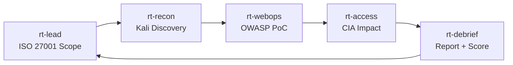

# Telegram Command Center (Web/API SecOps)

เอกสารนี้ออกแบบการประเมินความปลอดภัย Web/API ผ่าน Telegram **Forum Group + Topics** ให้ครบถ้วน โดยใช้ Agent ชุด `rt-*` ภายใต้กรอบ **ISO 27001** และ **OWASP Top 10**

---

## 1) โครงสร้าง Topics

| Topic | Agent | หน้าที่ |
|-------|-------|---------|
| `General` (thread `1`) | `rt-lead` | ควบคุม scope + phase (ISO 27001) |
| `01-Recon` | `rt-recon` | Asset discovery ด้วย Kali Tools |
| `02-WebOps` | `rt-webops` | OWASP PoC + Kali exploitation |
| `03-Access` | `rt-access` | C-I-A Impact assessment |
| `04-Debrief` | `rt-debrief` | OWASP Report + Mitigation plan |

---

## 2) OpenClaw Config Mapping

ใช้ไฟล์: `config-snippets/openclaw.rt-training.example.json`

```json
{
  "groups": {
    "-100REPLACE_TRAINING_GROUP_ID": {
      "groupPolicy": "allowlist",
      "requireMention": false,
      "allowFrom": ["REPLACE_TRAINER_USER_ID"],
      "topics": {
        "1": { "agentId": "rt-lead" },
        "101": { "agentId": "rt-recon" },
        "102": { "agentId": "rt-webops" },
        "103": { "agentId": "rt-access" },
        "104": { "agentId": "rt-debrief" }
      }
    }
  }
}
```

> ⚠️ `message_thread_id` ของ Topic จริงอาจไม่ใช่ 101-104 ต้องเช็กจาก Telegram API หรือ Bot logs

---

## 3) Runbook ตั้งค่า Telegram

1. สร้าง Telegram **Supergroup** → เปิด **Forum mode**
2. สร้าง 4 Topics: `01-Recon`, `02-WebOps`, `03-Access`, `04-Debrief`
3. เชิญ Bot เข้า group → ให้สิทธิ์อ่านข้อความ
4. เก็บ `chat.id` (group id) + `message_thread_id` ของแต่ละ topic
5. กรอกค่าใน `config-snippets/rt-training.env` แล้วรัน:
```bash
./scripts/instantiate-config.sh --force
cp config-snippets/openclaw.rt-training.generated.json ~/.openclaw/openclaw.json
openclaw gateway restart
openclaw channels status --probe
```

---

## 4) กติกาในกลุ่ม (ISO 27001 Compliance)

- Action เสี่ยงสูงต้องมี `#approve` เสมอ
- `rt-lead` ต้องประกาศ Scope (URL/IP ที่อนุญาต) ก่อนเริ่มทุกครั้ง
- ถ้า Agent ทำนอก Scope → ปฏิเสธทันที (Fail)
- ห้ามโพสต์ secret/token จริงในกลุ่ม
- ทุก PoC ต้องผูกกับ **OWASP Category** (เช่น A03:2021)

Template คำสั่ง:
```text
#approve
scope: web-lab-sqli-basic
phase: webops
target: http://127.0.0.1:3000
goal: PoC SQLi read-only (OWASP A03:2021)
constraints: ISO 27001 safe payload, no data exfiltration
```

---

## 5) Event Flow



---

## 6) Definition of Done

- Evidence จาก Kali Tool อย่างน้อย 3 ชิ้น
- Attack chain ครบ: entry → impact
- OWASP Top 10 mapping ≥ 3 categories
- Mitigation ขั้นต่ำ 3 ข้อ (Web/API defenses)
- `rt-debrief` ปิดงานด้วย ISO 27001 Risk Score

> Prompt สำหรับ copy/paste: [`skills/PROMPTS.md`](../skills/PROMPTS.md)
